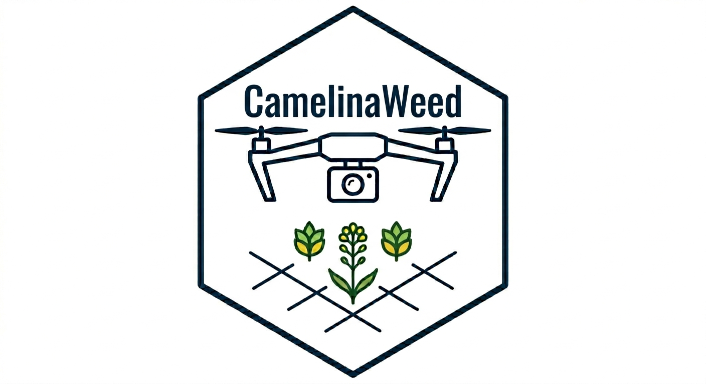

# CamelinaWeed: An Expert-Agronomist-Annotated UAV RGB and Multispectral Dataset for Weed and Crop Monitoring in *Camelina sativa*

<p align="center">
  <b>
    RGB and multispectral UAV imagery with polygon-based weed annotations by expert agronomists for precision agriculture research.
  </b>
</p>

<p align="center">
  <a href="DATASET_DOWNLOAD_LINK"><b>Dataset</b></a> ·
  <a href="PAPER_LINK"><b>Paper</b></a> ·
  <a href="https://doi.org/10.5281/zenodo.20148697"><b>DOI</b></a>
</p>

<p align="center">
  
</p>

## Table of Contents

- [Overview](#overview)
- [Annotation Preview](#annotation-preview)
- [Specifications Table](#specifications-table)
- [UAV Data Summary](#uav-data-summary)
- [UAV Flight Parameters](#uav-flight-parameters)
- [Dataset Evaluation](#dataset-evaluation)
- [Dataset Structure](#dataset-structure)
- [Data Preparation and Visualization Tools](#data-preparation-and-visualization-tools)
  
## Overview

This repository provides documentation for **CamelinaWeed**, a UAV-based dataset collected in *Camelina sativa* fields in Greece.

The dataset includes RGB and multispectral UAV imagery acquired from agricultural fields in Thessaloniki and Chalkidiki during summer 2025 and winter 2025–2026. It contains annotated RGB images with polygon-based weed annotations created by human experts. In addition to the annotated data, the dataset also provides raw RGB imagery, multispectral images, and orthomosaic products.

CamelinaWeed was created to support research in computer vision, precision agriculture, weed detection, crop monitoring, and field-level analysis under realistic agricultural conditions.


## Annotation Preview

<p align="center">
  
  &nbsp;&nbsp;
  
</p>

<p align="center">
<b>Turning raw UAV imagery into precise weed intelligence.</b><br>
<i>Expert polygon annotations for field-level weed detection, mapping, and monitoring.</i>
</p>

---

## Specifications Table

| Field | Description |
|---|---|
| **Subject** | Computer Science |
| **Specific subject area** | Computer Vision, Precision Agriculture, Weed Detection |
| **Type of data** | RGB images, annotation masks |
| **How data were acquired** | UAV imagery was acquired using a DJI Phantom 4 Pro and a DJI Mavic 3M. <br><br> DJI Phantom 4 Pro: RGB camera, 1'' CMOS, 20 MP effective pixels, FOV 84°, 8.8 mm / 24 mm equivalent focal length, f/2.8–f/11, autofocus from 1 m to ∞. <br><br> DJI Mavic 3M RGB camera: 4/3 CMOS, 20 MP effective pixels, FOV 84°, 24 mm equivalent focal length, f/2.8–f/11, focus from 1 m to ∞. <br><br> DJI Mavic 3M multispectral camera: 1/2.8-inch CMOS, 5 MP effective pixels, FOV 73.91° (61.2° × 48.10°), 25 mm equivalent focal length, f/2.0, fixed focus. Bands: Green (560 ± 16 nm), Red (650 ± 16 nm), Red Edge (730 ± 16 nm), Near Infrared (860 ± 26 nm). |
| **Data format** | Annotated RGB images: 3023 JPEG images; raw unannotated RGB images: JPEG; polygon annotations: JSON; orthomosaics: GeoTIFF; raw unannotated multispectral images: multi-band TIFF. |
| **Description of data collection** | RGB images were collected while UAVs performed coverage missions over *Camelina sativa* fields. During flights, the camera gimbal was adjusted to -89°, vertically oriented toward the field. Image acquisition was performed at flight altitudes of 2 m, 3 m, 5 m, and 10 m, depending on the field and UAV platform. Flight speed was set to 3 m/s. The dataset includes data from three agricultural fields in Thessaloniki and Chalkidiki, Greece, during summer and winter cultivation periods. |
| **Data source location** | Winter cultivation field — Thessaloniki, Greece: <br> `[40.766551, 22.993202; 40.766327, 22.994137; 40.767043, 22.994564; 40.767380, 22.993470]` <br><br> Winter cultivation field — Chalkidiki, Greece: <br> `[40.368424, 23.068174; 40.368555, 23.069137; 40.369965, 23.068723; 40.369791, 23.067736]` <br><br> Summer cultivation field — Thessaloniki, Greece: <br> `[40.565772, 22.990067; 40.566154, 22.991342; 40.568324, 22.989971; 40.567646, 22.988174; 40.566623, 22.988909]` |
| **Data accessibility** | **Repository name:** *CamelinaWeed: An Expert-Agronomist-Annotated UAV RGB and Multispectral Dataset for Weed and Crop Monitoring in *Camelina sativa** <br><br> **Direct URL to data:** [GitHub repository](https://github.com/aura-laboratory/A-UAV-Dataset-for-Crop-Monitoring-Weed-Mapping-and-Field-Analysis-in-Camelina-sativa) <br><br> **DOI:** [10.5281/zenodo.20148697](https://doi.org/10.5281/zenodo.20148697) <br><br> **Database description:** GitHub repository containing dataset documentation, dataset structure, annotation information, and download instructions. |


## UAV Data Summary
The following tables summarize the UAV imagery included in the dataset. The data are organized into two groups: **Data for Orthomosaic Generation**, which includes full-field acquisitions used to produce orthomosaic products, and **Data for Weed Detection**, which includes image sets categorized according to the presence or absence of visible weeds.


## Data for Orthomosaic Generation

| Season | Location | Acquisition setting | Images | Orthomosaic |
|:---:|:---:|:---:|:---:|:---:|
| Winter 2025–2026 | Thessaloniki | Mavic 3M flight at 20 m altitude RGB | 227 | ✓ |
| Winter 2025–2026 | Thessaloniki | Mavic 3M flight at 20 m altitude MS | 908 | ✓ |
| Winter 2025–2026 | Chalkidiki | Mavic 3M flight at 20 m altitude RGB | 1351 | ✓ |
| Winter 2025–2026 | Chalkidiki | Mavic 3M flight at 20 m altitude MS | 5404 | ✓ |

## Data for Weed Detection 

| Season | Location | Acquisition setting | Weed-positive images | Weed-negative images |
|:---:|:---:|:---:|:---:|:---:|
| Summer 2025 | Thessaloniki | Phantom flight at 5 m altitude | 34 | 32 |
| Summer 2025 | Thessaloniki | Phantom flight at 10 m altitude | 297 | 46 |
| Winter 2025–2026 | Thessaloniki | Phantom flight at 3 m altitude | 17 | 32 |
| Winter 2025–2026 | Thessaloniki | Mavic 3M flight 1 at 2 m altitude | 627 | 215 |
| Winter 2025–2026 | Thessaloniki | Mavic 3M flight 1 at 2 m altitude MS | — | 842 |
| Winter 2025–2026 | Thessaloniki | Mavic 3M flight 2 at 2 m altitude | 47 | 193 |
| Winter 2025–2026 | Thessaloniki | Mavic 3M flight 2 at 2 m altitude MS | — | 240 |
| Winter 2025–2026 | Chalkidiki | Phantom flight at 3 m altitude | 43 | 159 |
| Winter 2025–2026 | Chalkidiki | Phantom flight at 5 m altitude | 55 | 144 |


## UAV Flight Parameters

The following tables summarize the main flight and imaging parameters used during UAV data acquisition. Parameters are reported separately for **Flight Parameters for Orthomosaic Generation**, where full-field coverage required predefined overlap settings, and **Flight Parameters for Weed Detection**, where low-altitude flights were used to capture detailed crop and weed imagery at different spatial resolutions.

### Flight Parameters for Orthomosaic Generation

| Location | Acquisition setting | Drone | Camera | GSD (cm/pixel) | Frontlap (%) | Sidelap (%) |
|:---:|:---:|:---:|:---:|:---:|:---:|:---:|
| Thessaloniki | Mavic 3M flight at 20 m altitude RGB | Mavic 3M | RGB | 0.5 | 85 | 70 |
| Thessaloniki | Mavic 3M flight at 20 m altitude MS | Mavic 3M | MS | 0.5 | 85 | 70 |
| Chalkidiki | Mavic 3M flight at 20 m altitude RGB | Mavic 3M | RGB | 0.5 | 85 | 70 |
| Chalkidiki | Mavic 3M flight at 20 m altitude MS | Mavic 3M | MS | 0.5 | 85 | 70 |

### Flight Parameters for Weed Detection

| Location | Acquisition setting | Drone | Camera | GSD (cm/pixel) |
|:---:|:---:|:---:|:---:|:---:|
| Thessaloniki | Phantom flight at 5 m altitude | Phantom 4 Pro | RGB | 0.14 |
| Thessaloniki | Phantom flight at 10 m altitude | Phantom 4 Pro | RGB | 0.27 |
| Thessaloniki | Phantom flight at 3 m altitude | Phantom 4 Pro | RGB | 0.08 |
| Thessaloniki | Mavic 3M flight 1 at 2 m altitude | Mavic 3M | RGB | 0.15 |
| Thessaloniki | Mavic 3M flight 1 at 2 m altitude MS | Mavic 3M | MS | 0.15 |
| Thessaloniki | Mavic 3M flight 2 at 2 m altitude | Mavic 3M | RGB | 0.15 |
| Thessaloniki | Mavic 3M flight 2 at 2 m altitude MS | Mavic 3M | MS | 0.15 |
| Chalkidiki | Phantom flight at 3 m altitude | Phantom 4 Pro | RGB | 0.08 |
| Chalkidiki | Phantom flight at 5 m altitude | Phantom 4 Pro | RGB | 0.14 |


## Dataset Evaluation

To provide a baseline evaluation of the proposed UAV weed detection dataset, the RT-DETR-L object detection model was trained to detect two weed categories: broadleaf and narrowleaf weeds. The following table reports the main evaluation metrics obtained after training RT-DETR-L for 200 epochs using tiled image patches with an input resolution of 768 × 768 pixels.

| Metric | Value |
|:---:|:---:|
| Precision | 0.895 |
| Recall | 0.842 |
| F1-score | 0.870 |
| mAP@50 | 0.892 |
| mAP@50–95 | 0.704 |
| Inference speed | 9.8 ms/image |

## Dataset Structure

The dataset is organized hierarchically by acquisition season, location, UAV flight/acquisition setting, and data type.

```text
CamelinaWeed/
├── Summer 2025/
│   └── Thessaloniki/
│       ├── Phantom Flight at 5 m Altitude/
│       │   ├── Annotated/
│       │   │   ├── images/
│       │   │   └── annotations.json
│       │   └── Unannotated/
│       │       └── images/
│       └── ...
│
└── Winter 2025-2026/
    ├── Thessaloniki/
    │   ├── Phantom Flight at 3 m Altitude/
    │   │   ├── Annotated/
    │   │   │   ├── images/
    │   │   │   └── annotations.json
    │   │   └── Unannotated/
    │   │       └── images/
    │   ├── ...
    │   ├── Orthomosaic_RGB.tif
    │   └── Orthomosaic_MS.tif
    │
    └── Chalkidiki/
        ├── Phantom Flight at 3 m Altitude/
        │   ├── Annotated/
        │   │   ├── images/
        │   │   └── annotations.json
        │   └── Unannotated/
        │       └── images/
        ├── ...
        ├── Orthomosaic_RGB.tif
        └── Orthomosaic_MS.tif


## Data Preparation and Visualization Tools

The repository includes utility scripts for annotation visualization and dataset preparation for YOLO-based object detection and segmentation workflows.

### 1. Visualize COCO Polygon Annotations

`visualize_annotations.py` visualizes polygon-based COCO annotations on UAV RGB imagery. The script supports displaying annotations interactively or exporting annotated images for inspection and quality control.

Run for one image:

```bash
python scripts/visualize_annotations.py \
  --input "Summer 2025/Thessaloniki/Phantom Flight at 10 m Altitude/Annotated" \
  --image "DJI_0051_JPG.rf.nh87J09No53uRJWaoKVC.JPG" \
  --show-labels \
  --display
```

Run for one image and save the result:

```bash
python scripts/visualize_annotations.py \
  --input "Summer 2025/Thessaloniki/Phantom Flight at 10 m Altitude/Annotated" \
  --image "DJI_0051_JPG.rf.nh87J09No53uRJWaoKVC.JPG" \
  --show-labels \
  --save
```

Run for all images:

```bash
python scripts/visualize_annotations.py \
  --input "Summer 2025/Thessaloniki/Phantom Flight at 10 m Altitude/Annotated" \
  --all \
  --show-labels \
  --save
```

### 2. Prepare Dataset for YOLO Training

`prepare_dataset.py` converts COCO polygon annotations into YOLO-compatible detection or segmentation datasets. The script automatically creates train/validation/test splits, generates YOLO label files, and creates a `data.yaml` configuration file.

Run for YOLO segmentation:

```bash
python scripts/prepare_dataset.py \
  --input "Summer 2025/Thessaloniki/Phantom Flight at 10 m Altitude/Annotated" \
  --output prepared_dataset \
  --task segmentation
```

Run for YOLO detection:

```bash
python scripts/prepare_dataset.py \
  --input "Summer 2025/Thessaloniki/Phantom Flight at 10 m Altitude/Annotated" \
  --output prepared_dataset_detection \
  --task detection
```

Run recursively for all annotated folders:

```bash
python scripts/prepare_dataset.py \
  --input "." \
  --output prepared_dataset \
  --task segmentation
```
